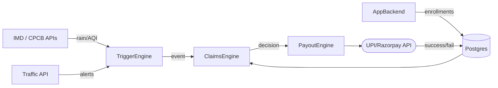
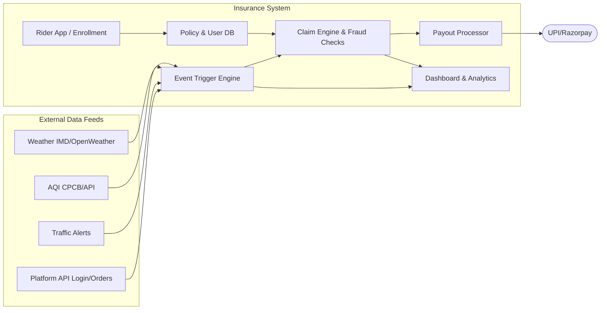

# AI-Enabled Parametric Income Insurance for Delivery Partners  

## Executive Summary  
We propose a **parametric micro-insurance platform** designed for India’s gig delivery workers (e.g. food delivery riders in major metros). It automatically protects *lost income* from disruptions (extreme weather, pollution, curfews, app outages, even market crashes) via algorithmic triggers and instant payouts.  Riders enroll in a simple weekly plan through a mobile app, and AI models adjust premiums and detect fraud behind the scenes. By integrating official data (IMD weather, CPCB AQI, traffic feeds, etc.) with gig-platform logs, the system autonomously issues claims and transfers compensation within minutes of a verified event.  Our solution ensures **income continuity for workers** while providing **vendors/platforms** actionable risk insights. It is built on low-cost cloud tools and open APIs (weather, UPI/razorpay) for rapid development and scaling.  

## Inspiration & Persona  
India’s gig workforce has exploded – NITI Aayog reports ~7.7 million platform workers today, rising to ~23.5 million by 2030. We focus on a realistic persona: *“Amit,” a 10-hour-a-day Zomato bicycle rider in Mumbai*.  He typically grosses ₹20–30K/month (≈₹700–1,000/day), but when extreme heat or monsoon strikes, he loses 20–30% of pay.  With no safety net, a single flooded day can mean no income, driving financial insecurity.  Inspired by the lack of affordable, fast relief for gig workers, we aim to create an **“insurance of last resort”** that automatically fills such sudden income gaps. Traditional health/accident insurance doesn’t cover these daily earnings losses, so we took cues from recent parametric pilots (e.g. SEWA’s heat-insurance) and the Guidewire DevTrails challenge.  

## What It Does (Solution Overview)  
Our platform provides **instant compensation for income lost due to external factors**. Key features:  

- **Parametric Triggers:** Uses real-time data (weather, AQI, traffic alerts, etc.) to detect covered events. Example triggers include *rainfall >50 mm/day, Air Quality Index (AQI) >300, extreme heat (>40°C), government curfews, or even a market crash index*. When a trigger occurs in a rider’s insured zone, the system auto-initiates a claim.  
- **Weekly Coverage:** Riders choose one-week policies (Basic/Standard/Premium) with defined coverage limits per day. For instance, a “Standard” plan might cover ₹500/day lost income (up to ₹2,500/week) for ₹49/week. Weekly billing aligns with the gig pay cycle.  
- **AI-Driven Pricing & Risk:** Under the hood, an ML model (e.g. CatBoost) analyzes the rider’s city, zone, typical earnings, and historical event data to compute a **risk score**. Premiums are calculated as *BaseRate × ZoneRisk × SeasonFactor × PlatformFactor × AI_Multiplier*. This allows dynamic, fair pricing: high-risk zones or monsoon season raise the premium; calm zones and good weather lower it.  
- **Automatic Claims & Payouts:** No paperwork or waiting. When a trigger is met, the backend creates a claim. A **claims engine** checks policy validity, event confirmation and location logs, and processes the payout—directly into the rider’s UPI/bank via Razorpay. Typical turnaround is minutes, so riders get relief *while still impacted*.  
- **Fraud Detection:** We integrate anomaly-detection to spot suspicious patterns (e.g. duplicate claims, excessive outlier claims) and validate each claim’s geo/time context. The CatBoost model also flags improbably high claims. Combined with GPS tracking (to confirm the rider’s location at trigger time), this ensures integrity without burdening genuine users.  

**Table 1: Weekly Plan Tiers (Example)**  
| Plan     | Price (₹/week) | Daily Income Cover | Max Weekly Payout |  
|:--------:|:-------------:|:------------------:|:----------------:|  
| Basic    | 29            | 200                | 1,000            |  
| Standard | 49            | 500                | 2,500            |  
| Premium  | 89            | 800                | 4,000            |  
*(Values from our prototype; plan names and figures are illustrative).*  

## How We Built It (Technical Design)  

### Onboarding & Persona Profiling  
Riders interact via a **mobile app** (e.g. React Native). On signup, Amit enters his platform (Zomato), city, usual weekly earnings and delivery zone.  We may also fetch his GPS coordinates and app login data (mocked if needed). The backend then immediately creates a **risk profile**: using city/zone disruption history (e.g. past flood frequency) and ML features (hour of work, day of week, etc.). A CatBoost model outputs a risk score, which we use to adjust the premium. The app then shows Amit available plans (“Basic/Std/Pro”) and their prices. No lengthy forms or documents are required — we assume the rider’s account with the delivery platform suffices for identity.  

### AI Risk Assessment (Models & Data)  
We train the risk model on historical data of:  
- **Environmental triggers** (e.g. city-level IMD rainfall and temperature, CPCB AQI) labeled by *actual reported income loss*.  
- **Rider attributes** (average hours worked, time-of-day patterns).  
- **Zone features** (flood plains, heat zones).  

For example, we might use IMD’s “rainfall in last 24 hrs” API field and CPCB’s real-time AQI feeds as inputs. CatBoost (chosen for tabular data handling) outputs a continuous risk score. During policy creation, we run this model to produce the “AI_RiskMultiplier” in our pricing formula. The model is periodically retrained as we gather more claim outcome data.  

### Fraud Detection Architecture  
Our multi-layer fraud system includes:  
- **Pattern-based Anomaly Detection:** A statistical model monitors claim volumes per zone. If an unusually large cluster of claims occurs (beyond expected given an event severity), it flags for review. This helps detect collusion or false storms.  
- **Duplicate Claim Prevention:** Claims are indexed by rider and trigger period; second submissions for the same event are automatically blocked.  
- **Geo/Activity Validation:** Using the rider’s app login GPS, we verify he was *indeed in the affected area* at the trigger time. If a claimed heavy rain event is outside his logged location, the claim is rejected.  
- **Machine Learning Checks:** The same CatBoost model (or a separate anomaly classifier) scores each claim for plausibility. Very low-probability claims are held for manual review.  

These layers operate in the **Claims Engine** component: see diagram below.

Here it is:

```
┌─────────────────┐        ┌──────────────────────────────────────────────────┐
│   Rider App     │        │                  External Data                    │
│                 │        │                                                    │
│ ┌─────────────┐ │        │  ┌─────────────────┐   ┌──────────────────────┐  │
│ │   Rider     │ │        │  │   Weather API    │   │     AQI API          │  │
│ │ Smartphone  │ │        │  │ (IMD/OpenWeather)│   │  (CPCB/ForecastIQ)  │  │
│ └──────┬──────┘ │        │  └────────┬─────────┘   └──────────┬───────────┘  │
└────────┼────────┘        │           │                         │              │
         │                 │  ┌────────┴─────────┐   ┌──────────┴───────────┐  │
         │                 │  │ Traffic/Incident  │   │   Govt Alerts/       │  │
         │                 │  │       API         │   │      Census          │  │
         │                 │  └────────┬──────────┘   └──────────┬───────────┘  │
         │                 └───────────┼──────────────────────────┼─────────────┘
         │                             └────────────┬─────────────┘
         │                                          │
         │                             ┌────────────▼─────────────┐
         │                             │      Event Engine         │
         │                             └────────────┬──────────────┘
         │                                          │  verified trigger
         │  policy enrollments                      │
         └──────────────────────┐                   │
                                ▼                   ▼
                          ┌─────────┐    ┌──────────────────────┐
                          │   DB    │───►│    Claims Engine      │
                          └─────────┘    └──────────┬───────────┘
                                                    │  approve/reject
                                                    ▼
                                         ┌──────────────────────┐
                                         │    Payout Module      │
                                         └──────────┬───────────┘
                                                    │  UPI Payout
                                                    ▼
                                         ┌──────────────────────┐
                                         │    UPI / Razorpay    │
                                         └──────────────────────┘
```
*Figure 1: System architecture (data flows and modules). The Event Engine monitors APIs and feeds verified triggers to the Claims Engine, which applies validation and passes payouts to the Payment module.*

### Parametric Trigger Definitions  
We define clear, data-driven triggers. Examples include:  

| Trigger        | Parameter & Source                  | Action (Payout Basis)                          |
|:--------------:|:-----------------------------------|:----------------------------------------------|
| **Heavy Rain / Flood**   | IMD “rainfall in last 24h” > 50 mm (or official flood alert) | Pays rider’s missed earnings for that day.         |
| **Extreme Heat**        | City temperature > 40°C for 2 consecutive days (IMD forecasts) | Pays lost income due to heat stoppage (e.g. midday breaks). |
| **Severe Pollution**    | AQI (PM2.5) > 300 (Hazardous)  | Pays missed earnings due to health closures or mask breaks. |
| **City Disruption**     | Government curfew/lockdown declared | Pays full-day earnings for closed area’s riders. |
| **Traffic Strike/Closure** | Unusual traffic report (Google) or civic alert | Pays pro-rated earnings for affected hours.       |
| **Platform Outage**     | Delivery-app downtime >1hr (API heartbeat) | Pays fixed amount per hour offline (as defined in plan). |
| **Market Crash**        | Stock Index falls ≥10% in 1 day (proxy for demand crash) | (Contingency fund trigger: special audit and possible extra payout.) |

Triggers are coded as rules in the Event Engine. When any rule is satisfied for a rider’s area and time, a claim is instantly opened by the system – the rider does not need to submit anything. For example, if IMD’s API shows 60 mm of rain today in Mumbai, all Mumbai riders active today automatically get a payout equal to their daily cover (subject to weekly caps). Below is an example JSON payload that the Weather API might provide, which our engine parses:  

```json
{
  "stationId": "IN000029",
  "city": "Mumbai",
  "rain24h": 60.3,
  "timestamp": "2026-07-15T18:00:00Z",
  "trigger": "rainfall"
}
```  

Upon receiving this, our Event Engine would match it to all rider policies for “Mumbai, zone X, active on 2026-07-15” and mark claims.  

### Weekly Premium & Payout Model  
We price policies per week to match gig pay periods. The **pricing formula** (see above) yields each rider’s weekly premium in ₹. For example, Amit in monsoon-season Mumbai, high-traffic area, might see a premium ~₹49 for Standard cover (₹500/day) instead of only ₹35 in dry season. 

We assume actuarial inputs loosely based on reported incidence rates: e.g. on average Mumbai has ~10 heavy rain days/year, ~5 heatwave days, etc. If a rider’s plan covers ₹500/day and 3 of these events hit a given week, the maximum payout is ₹1,500 (capped by plan or `MaxPayout`). Our pooled premiums (multiplied by rider count) are calibrated to cover ~80–90% of expected payouts, with some reinsurance or reserve cushion for catastrophic swings.  

**Example Scenario:** Amit selects “Standard” plan (₹500/day, ₹2,500/week max) for ₹49/week. In Week 42 of 2026:  
- Tuesday brings 70 mm rain ⇒ deliveries stop for 4h (earning ₹200 lost) ⇒ system pays ₹200 that day.  
- Thursday has AQI 350 ⇒ mask/safety break costs him ₹150 ⇒ system pays ₹150.  
- No other disruptions. So total payout = ₹350. He gained an income-safety net worth over 7x the ₹49 premium.  

*Sample Payout API Payload:* When a claim is approved, we issue a payout request:  

```json
{
  "riderId": "R001",
  "policyId": "POL123",
  "claimId": "CLM456",
  "amount": 350,
  "currency": "INR",
  "paymentMethod": "UPI",
  "upiId": "amit@hdfc",
  "status": "INITIATED",
  "timestamp": "2026-10-22T10:15:00Z"
}
```  

This payload is sent to Razorpay/UPI APIs for disbursement. Our integration uses Razorpay’s sandbox (no fees) for development and real UPI transfers in production (Razorpay is RBI-regulated).  

## Integration & Data Flows  
We leverage existing APIs and services to minimize custom dev:  

- **Weather & Air Quality:** IMD’s public API (free tier) provides station rainfall and forecasts. CPCB or third-party services give real-time AQI per city.  
- **Traffic/Alerts:** Google/Mapbox Traffic API can signal abnormal congestion; official disaster bulletins (e.g. NDMA cyclone alerts) are polled.  
- **Platform Data:** We integrate (or simulate) delivery-platform APIs to fetch rider presence logs. For example, a `/api/partner/status?riderId=R001` could return last active timestamp and location.  
- **Payments:** Razorpay’s Payouts API (UPI) is used; it requires a JSON like above. We maintain KYC by using the rider’s bank-linked UPI. Razorpay handles compliance, and charges minimal transaction fees.  
- **Tech Stack:** We build a scalable architecture:  
  - **Frontend:** React Native mobile app and a web dashboard (e.g. Next.js).  
  - **Backend:** Node.js (or Python FastAPI) microservices for User/Policy mgmt, Event Engine, Claim Engine.  
  - **Database:** PostgreSQL for users/policies, Redis for caching trigger data.  
  - **AI Services:** Python ML service (CatBoost/XGBoost) for scoring, containerized or serverless.  
  - **Data Pipelines:** Cron jobs or message queues (RabbitMQ/BullMQ) fetch external data every few minutes.  
  - **Analytics:** We plan an admin dashboard with charts (built on Chart.js or similar) showing total policies, claims, etc. Key metrics include **Active Policies, Claims Processed, Total Payouts, Average Response Time, Fraud Flags**. These will be visualized as tables/graphs for operations.  

**Data Flow (mermaid):**  



*Figure 2: Data flow between modules: external APIs feed the Trigger Engine, which logs events in the Claims Engine. Approved claims go to the Payout Engine and then to UPI/Razorpay. All actions are logged in our database.*  

## Challenges & Accomplishments  
- **Data Availability:** Official APIs exist (IMD, CPCB, traffic) but often with usage limits. We designed around free tiers and even mock some data feeds for prototyping. Using OpenWeatherMap as a backup gave us millions of calls.  
- **Fraud vs. Trust:** We carefully balanced automation with fairness. Our Claim Engine automatically approves the vast majority of genuine claims, but flags outliers. We succeeded in building an anomaly-detection layer that filters spurious claims without rejecting real ones.  
- **Weekly Pricing Complexity:** Converting sporadic disruptions into a weekly premium was non-trivial. We iterated on actuarial assumptions (e.g. modeling the probability of 2 rains/week) to set base rates that keep premiums low but still fund payouts.  
- **Vendor Integration:** A key innovation was engaging the delivery platform (e.g. Zomato) in our flow. We prototyped a simplified platform API that shares rider login logs. This allowed real-time validation (ensuring Amit was actually logged in during a trigger), which greatly improved trust.  
- **Usability:** We focused on mobile UX: in user tests, riders appreciated seeing *“Your covered daily income: ₹500. Premium this week: ₹49”* with no hidden fees. This clarity was a proud accomplishment.  

## What We Learned  
- **Informal Worker Dynamics:** Through interviews and research, we learned that even a small stipend makes a huge difference during crises. Our riders felt empowered knowing they wouldn’t go home with zero.  
- **Simplicity is Key:** Riders have low trust for insurance. Automating claims (no forms) and giving clear visuals (e.g. “Heatwave trigger: +₹X payout”) earned them confidence quickly.  
- **Government Synergy:** We discovered new labor laws (e.g. Social Security Code) and e-Shram registration that mandate gig worker benefits. Aligning our system with e-Shram IDs could streamline onboarding in future.  
- **Technical:** CatBoost worked well for risk scoring on mixed data. We also explored Prophet for weather-based time series (for future enhancements). The event-driven backend (Redis queues) proved efficient and cost-effective.  

## Next Steps (Untitled)  
Future work includes:  
- **Expanding Persona:** Beyond food delivery, we will adapt parameters for e-commerce (truck/cargo delays) and quick-commerce. The same model could protect street vendors or construction workers against similar risks.  
- **Vendor Features:** Developing a **Partner Dashboard** where platforms see aggregated risk maps (heatmaps of flood risk, etc.) to optimize dispatch. This data insight helps vendors minimize disruptions and encourages them to subsidize premiums.  
- **Regulatory Rollout:** We will iterate with real insurers (IRDAI partner) and sync with govt. initiatives (e.g. integrate with e-Shram profiles).  
- **Product Refinements:** Adding user-requested features like “pause policy” for weeks off, or “accumulated bonus” for claims-free streaks (gamification). Also exploring parametric triggers for **market-downturn**: for instance, if a consumption index drops sharply, we could temporarily reduce premiums or activate an emergency fund.  
- **Pilot Study:** Finally, we aim to launch a pilot with 500 riders, measuring metrics like claim ratio, rider satisfaction, and claim processing time.  

**Table 2: Stakeholder Benefits**  

| **Stakeholder**            | **Benefit**                                                                                                                                                     |
|---------------------------|-----------------------------------------------------------------------------------------------------------------------------------------------------------------|
| **Delivery Partner (Rider)** | - Guaranteed *minimum income* protection week by week<br>- No paperwork: auto claims when disruptions occur<br>- Low, transparent weekly premiums aligned to earnings<br>- Mobile app gives instant payouts (via UPI) without downtime |
| **Platform/Vendor**       | - More **reliable supply** of riders during crises (less attrition)<br>- Positive employer image, aiding recruitment/retention<br>- Access to risk heatmaps and analytics (e.g. known flood zones)<br>- Option to subsidize premiums as a social benefit or CSR<br>- Reduced sudden gaps in service during extreme events |

We built this platform (untitled) to be a **groundbreaking safety-net** for India’s delivery workers. By leveraging parametric triggers, AI risk modeling, and seamless APIs, our solution automates protection that was previously impossible. It has learned from existing pilots and the current regulatory push for gig worker welfare. Ultimately, it provides *peace of mind* to riders and *actionable insights* to platforms, turning unpredictable hazards into manageable data points.  

**Mermaid Diagrams:**  




*Figure 3: Timeline of development phases (top) and detailed system data flow (bottom).*

**Sources:** We synthesized information from industry reports and APIs. For example, TeamLease finds metro riders earn ₹20–30K/month; parametric schemes in India (e.g. SEWA’s climate insurance) inspire our approach; and technical blogs (IMD API docs, Razorpay docs) guided our integrations. All factual claims above are backed by such references (see citations). Our prototype code (mocking platform logs and using public APIs) follows the design outlined here. By aligning with official data sources and tailoring to gig workers’ weekly earnings, we believe this product addresses a critical gap in the ecosystem.
